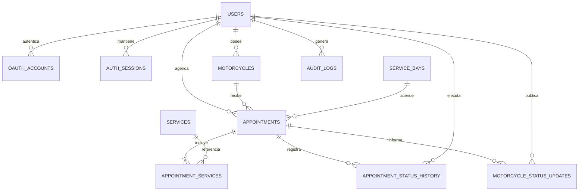

# Modelo de datos

## Criterios

- Un cliente puede registrar varias Honda NAVI.
- Una cita pertenece al cliente y a una de sus motos.
- Una cita contiene uno o más servicios con precio, nombre y duración congelados
  como snapshot. Cambiar el catálogo no altera el historial.
- La disponibilidad se expresa con horarios, excepciones y bahías físicas. Cada
  cita confirmable ocupa una bahía durante un rango de tiempo.
- El estado administrativo de la cita y el progreso de la moto se registran por
  separado y con historial.
- Los identificadores son UUID y todas las fechas operativas se guardan como
  `timestamptz`. La presentación usa `America/Santiago`.

## ERD



## Tablas y responsabilidades

| Tabla                        | Responsabilidad                                          |
| ---------------------------- | -------------------------------------------------------- |
| `users`                      | Perfil local, rol y estado de acceso.                    |
| `oauth_accounts`             | Vincula el `sub` inmutable de Google con un usuario.     |
| `auth_sessions`              | Sesiones revocables; solo persiste el hash del token.    |
| `motorcycles`                | NAVI registradas por cada cliente.                       |
| `services`                   | Catálogo, duración y precio vigentes.                    |
| `service_bays`               | Recursos físicos que determinan la capacidad simultánea. |
| `business_hours`             | Uno o más intervalos regulares por día de la semana.     |
| `schedule_exceptions`        | Cierres, aperturas especiales o capacidad reducida.      |
| `appointments`               | Reserva, rango horario, moto, cliente, bahía y estado.   |
| `appointment_services`       | Servicios y valores congelados al reservar.              |
| `appointment_status_history` | Auditoría del ciclo de la cita.                          |
| `motorcycle_status_updates`  | Timeline visible/no visible del trabajo en la NAVI.      |
| `audit_logs`                 | Acciones sensibles de administración.                    |

## Estados

Flujo normal de cita:

```text
requested -> confirmed -> checked_in -> in_service -> ready -> completed
    |             |             |
    +-----------> cancelled <----+
    +-----------> no_show
```

El backend valida transiciones; no se permite modificar el estado directamente
desde el cliente. El progreso de la moto (`received`, `diagnosing`,
`waiting_approval`, `repairing`, `quality_check`, `ready_for_pickup`, `delivered`)
alimenta una línea de tiempo independiente.

## Cálculo y reserva de disponibilidad

1. Sumar las duraciones snapshot de los servicios seleccionados.
2. Obtener los intervalos de `business_hours` y aplicar `schedule_exceptions`.
3. Generar inicios alineados a `slot_minutes` dentro de la zona del taller.
4. Descartar rangos que no quepan completos o solapen citas activas.
5. Mostrar un horario si al menos una `service_bay` compatible está libre.
6. Al reservar, iniciar transacción, tomar un bloqueo transaccional por rango,
   volver a comprobar y asignar una bahía. Las restricciones `EXCLUDE` son la
   última defensa contra carreras concurrentes.

La validación de horarios reside en el caso de uso de agenda; la base de datos
protege las invariantes de propiedad y no solapamiento.
